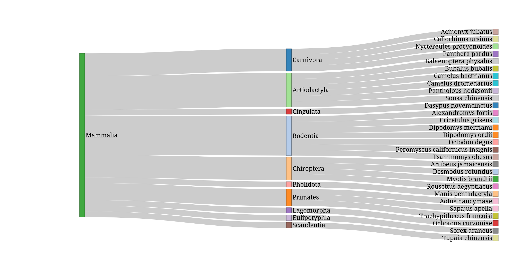

# taxidsankey

**taxidsankey** is an R script for visualizing the taxonomic lineage of a list of NCBI TaxIDs as an interactive Sankey diagram (HTML). This tool is useful for exploring the taxonomic structure of genome datasets or any list of NCBI taxids.

## Features

- **Input:** A file containing a list of NCBI TaxIDs (one per line).
- **Output:** An interactive HTML Sankey diagram (default).
- **Flexible rank selection:** Choose which taxonomic ranks to display (by name or by number).
- **Automatic taxonomy download:** If the required NCBI taxonomy lineage file is missing, it is automatically downloaded and extracted.
- **Example test data:** Provided in `data/test/mammals_taxid.txt`.

## Installation

1. **Install R packages:**  
   In R, run:
   ```r
   install.packages(c("argparse", "networkD3"))
   ```

2. **Clone this repository** and ensure you have internet access for the first run (to download NCBI taxonomy data if needed).

## Usage

### Command Line

```sh
Rscript taxidsankey.R -i data/test/mammals_small_taxid.txt -o mammals_small.html --ranks 4,5,9
```

### Example Output

A sample output generated by the script is shown below:



**Options:**
- `-i`, `--input`   : Input file with taxids (required)
- `-o`, `--output`  : Output HTML file (default: `sankey_diagram.html`)
- `-r`, `--ranks`   : Comma-separated list of ranks to display (by name or number, e.g. `domain,phylum,species` or `1,5,9`)
- `-l`, `--lineage` : Path to rankedlineage.dmp (default: auto-managed in `taxdump/`)

**Examples:**
```sh
# Default: all ranks, HTML output
Rscript taxidsankey.R -i data/test/mammals_taxid.txt

# Select specific ranks by name
Rscript taxidsankey.R -i data/test/mammals_taxid.txt -r domain,phylum,species

# Select specific ranks by number (1=domain, 9=species)
Rscript taxidsankey.R -i data/test/mammals_taxid.txt -r 1,5,9
```

### In R

You can also call the function directly:
```r
source("taxidsankey.R")
taxidsankey(taxid_file = "data/test/mammals_taxid.txt", ranks = c("domain", "phylum", "species"))
taxidsankey(taxid_file = "data/test/mammals_taxid.txt", ranks = 1:9, output_html = "allranks.html")
```

## Data

- The script will automatically download and extract the latest NCBI taxonomy lineage file (`rankedlineage.dmp`) into the `taxdump/` directory if it is not present.
- Example input:  
  ```
  data/test/mammals_taxid.txt
  ```

## Requirements

- R (≥ 3.6)
- R packages: `argparse`, `networkD3`
- Internet access (for first run or if taxonomy data is missing)

## License

MIT License

---

*This project is not affiliated with NCBI. Taxonomic data is obtained from NCBI datasets and lineage files.*